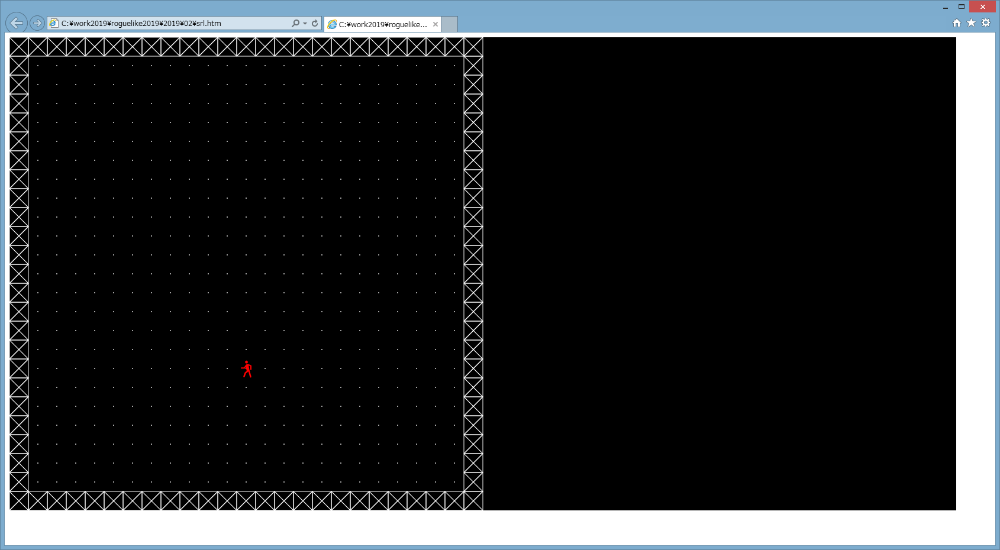

## ローグライクゲームを作ってみるその2 ダンジョン・プレイヤーの生成と描画

元風俗嬢のゆりなです。

風俗嬢をやったら精神がボロボロになってしまったので、ちょっと簡単なゲームでも作ってリフレッシュすることにします。

### 過去記事一覧

* [その1 タイトル画面](https://qiita.com/pizyumi/items/3526fddd4f18a462e1ae)

現在のコードについては前回の記事を参照してください。

### ダンジョン生成

ローグライクゲームのポイントって何点かあると思うのですが、その1つはダンジョン生成だと思います。

ランダム生成なのは勿論ですが、適度に探索しやすく、それでいて探索しがいのあるダンジョンが理想だと思います。

でも、そんなダンジョンを最初から生成するのって難しいですよね。

それより先にとりあえず動くものを作ってしまいたいです。

そこで今回はダンジョン生成については何も考えません。

空っぽの部屋を1つ作るだけにします。

今回は描画処理の実装を頑張ります。

---

まずダンジョンの（暫定的な）仕様を決めましょう。

* 2D
* 正方形のマスを縦横に敷き詰める
* 正方形のマスは縦横32ピクセル
* 床と壁から成り、床はプレイヤーが歩けるが、壁は歩けない
* 1つのフロアの大きさは25x25

とりあえずこんな感じにしましょう。

フロアの大きさを25x25にしたのは、これだとフロアの大きさは25*32=800ピクセルとなり、ちょうどゲーム画面に収まるからです。

ゲーム画面に収まらないとフロアの一部しか描画できないということになり面倒なのです。

勿論最終的にはもっと広いフロアにも対応可能にしていきたいですが。

という訳で、コードを書いていきましょう。

まずフロアの大きさと1マスのピクセル数を定義します。

```js
var LX = 25;
var LY = 25;
var PX = 32;
var PY = 32;
```

マスの種類は数値で表すことにします。

床は`0`、壁は`1`とします。

```js
var B_FLOOR = 0;
var B_WALL = 1;
```

フロアを作成する関数`create_field`を作成します。

端だけ壁にし、それ以外は床にします。

```js
function create_field () {
	var f = [];
	for (var i = 0; i < LX; i++) {
		f[i] = [];
		for (var j = 0; j < LY; j++) {
			if ((i === 0 || j === 0) || (i === LX -1 || j === LY - 1)) {
				f[i][j] = {
					base: B_WALL
				};
			}
			else {
				f[i][j] = {
					base: B_FLOOR
				};
			}
		}
	}

	return f;
}
```

前回空にしておいた`init`関数を実装します。

フロアを作成し、`field`変数に格納します。

```js
var field = null;

function init () {
	field = create_field();
}
```

### ダンジョンの描画

次にダンジョンの描画を行います。

`draw`関数を下のようにします。

```js
function draw (con) {
	con.fillStyle = 'black';
	con.fillRect(0, 0, SCREEN_X, SCREEN_Y);

	if (!startf) {
		con.textBaseline = 'alphabetic';
		con.textAlign = 'center';
		con.fillStyle = 'white';

		con.font = "48px consolas";
		con.fillText(TITLE, SCREEN_X / 2, SCREEN_Y / 4);

		con.font = "32px consolas";
		con.fillText('> はじめる', SCREEN_X / 2, SCREEN_Y / 4 * 3);	

		return;
	}

	for (var i = 0; i < LX; i++) {
		for (var j = 0; j < LY; j++) {
			if (field[i][j].base === B_FLOOR) {
				con.fillStyle = 'white';
				con.beginPath();
				con.arc((i + 0.5) * PX, (j + 0.5) * PY, 1, 0, Math.PI * 2);
				con.closePath();
				con.fill();
			}
			else if (field[i][j].base === B_WALL) {
				con.strokeStyle = 'white';
				con.strokeRect(i * PX, j * PY, PX, PY);
				con.beginPath();
				con.moveTo(i * PX, j * PY);
				con.lineTo((i + 1) * PX, (j + 1) * PY);
				con.moveTo((i + 1) * PX, j * PY);
				con.lineTo(i * PX, (j + 1) * PY);
				con.closePath();
				con.stroke();
			}
		}
	}
}
```

マスが床の場合には白い点をマスの中心に描画します。

また、マスが壁の場合は四角に囲まれた×を描画します。

これにより描画されるダンジョンは下のようになります。


### プレイヤーの生成

次にプレイヤーを生成します。

`init`関数を下のように変更します。

```js
var player = null;

function init () {
	field = create_field();
	player = {
		x: 12, 
		y: 17
	};
}
```

プレイヤーを作成し、`player`変数に格納します。

プレイヤーは以下のプロパティを持ちます。

* `x`・・・プレイヤーのダンジョンにおける横方向の位置
* `y`・・・プレイヤーのダンジョンにおける縦方向の位置

プレイヤーのダンジョンにおける最初の位置は`(12, 7)`とすることにしました。

### プレイヤーの描画

次にプレイヤーの描画を行います。

`draw`関数に下のようなコードを追加します。

```js
	con.textBaseline = 'middle';
	con.textAlign = 'center';
	con.fillStyle = 'red';
	con.fillText('🚶\uFE0E', player.x * PX + (PX / 2), player.y * PY + (PY / 2));
```

プレイヤーがいるマスに人の絵文字を赤色で描画します。

ただし、絵文字はテキストスタイルにしなければなりませんので、絵文字の後ろには異字体セレクタのVS15（`U+FE0E`）を付加します。

これにより描画されるダンジョンは下のようになります。



### 今回はここまで

今回はここまでです。

`game.js`は下のようになりました。

```js
var TITLE = 'シンプルローグライク';

var SCREEN_X = 1600;
var SCREEN_Y = 800;

var LX = 25;
var LY = 25;
var PX = 32;
var PY = 32;

var B_FLOOR = 0;
var B_WALL = 1;

var startf = false;

var field = null;
var player = null;

$(function(){
	var canvas = document.getElementById('game');
	var con = canvas.getContext('2d');

	var c = $('body');
	c.on('keydown', function (e) {
		if (!startf) {
			if (e.keyCode === 90) {
				startf = true;
	
				init();
	
				draw(con);
			}
		}
	});

	draw(con);
});

function init () {
	field = create_field();
	player = {
		x: 12, 
		y: 17
	};
}

function create_field () {
	var f = [];
	for (var i = 0; i < LX; i++) {
		f[i] = [];
		for (var j = 0; j < LY; j++) {
			if ((i === 0 || j === 0) || (i === LX -1 || j === LY - 1)) {
				f[i][j] = {
					base: B_WALL
				};
			}
			else {
				f[i][j] = {
					base: B_FLOOR
				};
			}
		}
	}

	return f;
}

function draw (con) {
	con.fillStyle = 'black';
	con.fillRect(0, 0, SCREEN_X, SCREEN_Y);

	if (!startf) {
		con.textBaseline = 'alphabetic';
		con.textAlign = 'center';
		con.fillStyle = 'white';

		con.font = "48px consolas";
		con.fillText(TITLE, SCREEN_X / 2, SCREEN_Y / 4);

		con.font = "32px consolas";
		con.fillText('> はじめる', SCREEN_X / 2, SCREEN_Y / 4 * 3);	

		return;
	}

	for (var i = 0; i < LX; i++) {
		for (var j = 0; j < LY; j++) {
			if (field[i][j].base === B_FLOOR) {
				con.fillStyle = 'white';
				con.beginPath();
				con.arc((i + 0.5) * PX, (j + 0.5) * PY, 1, 0, Math.PI * 2);
				con.closePath();
				con.fill();
			}
			else if (field[i][j].base === B_WALL) {
				con.strokeStyle = 'white';
				con.strokeRect(i * PX, j * PY, PX, PY);
				con.beginPath();
				con.moveTo(i * PX, j * PY);
				con.lineTo((i + 1) * PX, (j + 1) * PY);
				con.moveTo((i + 1) * PX, j * PY);
				con.lineTo(i * PX, (j + 1) * PY);
				con.closePath();
				con.stroke();
			}
		}
	}

	con.textBaseline = 'middle';
	con.textAlign = 'center';
	con.fillStyle = 'red';
	con.fillText('🚶\uFE0E', player.x * PX + (PX / 2), player.y * PY + (PY / 2));
}
```

次回はプレイヤーの移動を行いたいと思います。
