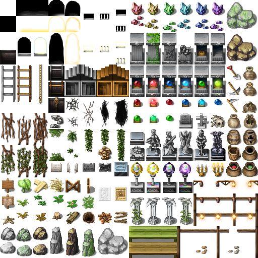
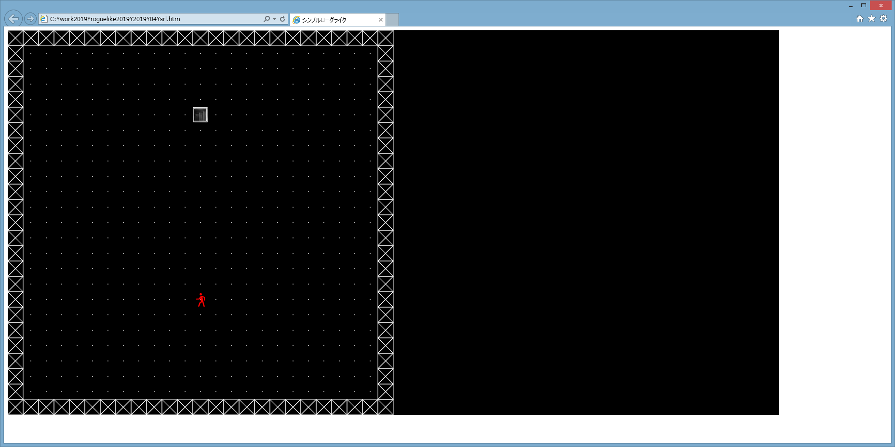

## ローグライクゲームを作ってみるその4 ダンジョンのランダム生成

### 過去記事一覧

* [その1 タイトル画面](https://qiita.com/pizyumi/items/3526fddd4f18a462e1ae)
* [その2 ダンジョン・プレイヤーの生成と描画](https://qiita.com/pizyumi/items/2562a159f497a608615b)
* [その3 プレイヤーの移動](https://qiita.com/pizyumi/items/07447c9a1a52b0d9a228)

現在のコードについては前回の記事の最後の項を参照してください。

### 複数のフロア

今回はダンジョンのランダム生成をやってみようと思いますが、その前に複数のフロアを移動できるようにしようと思います。

現在は1つのフロアしか生成されず、そのフロアを移動することしかできません。

これを下のように変更します。

* 全てのフロアには1つの下り階段が設置され、その階段から1つ下のフロア（階）に移動することができる。
* とりあえず上り階段は設置しない（一度下のフロアに移動してしまうと、上のフロアに戻ることはできない）。

まず、現在のプログラムはフロアが1つであることを前提として組んでいたので、複数のフロア（階）に対応できるように変更します。

現在は`field`変数にフロアのデータを格納していましたが、今後は複数のフロアのデータを格納することになるためこの変数の名称を`fields`に変更します。

```js
var fields = null;
```

そして、`init`関数を下のように変更します。

`fields`変数は配列となり、先頭の要素として最初のフロアのデータを格納します。

また、`player.depth`を追加します。これはプレイヤーが現在いる階数を表すことにします。最初のフロアの階数は`0`とします。そのため、`player.depth`の初期値は`0`となります。この値は下り階段を使って1つ下の階に移動することによって`1`増加することになります。

```js
function init () {
	fields = [];
	fields[0] = create_field();
	player = {
		depth: 0, 
		x: 12,
		y: 17
	};
}
```

そして、今まで`field`変数を使用してフロアのデータを参照していたコードを`fields`変数を使用するように変更します。

2つ目の`keydown`イベントハンドラの`field`変数を使用していた部分を下のように変更します。

```js
	c.on('keydown', function (e) {
（省略）
		if (e.keyCode >= 37 && e.keyCode <= 40) {
（省略）
			if (x !== player.x || y !== player.y) {
				var block = fields[player.depth].blocks[x][y];
				if (B_CAN_STAND[block.base]) {
					player.x = x;
					player.y = y;
				}
				else {
					return;
				}
			}
			else {
				return;
			}
		}
		else {
			return;
		}

		draw(con, env);
	});
```

また、`draw`関数の`field`変数を使用していた部分を下のように変更します。

```js
function draw (con, env) {
（省略）
	for (var i = 0; i < LX; i++) {
		for (var j = 0; j < LY; j++) {
			var block = fields[player.depth].blocks[i][j];
			if (block.base === B_FLOOR) {
				con.fillStyle = 'white';
				con.beginPath();
				con.arc((i + 0.5) * PX, (j + 0.5) * PY, 1, 0, Math.PI * 2);
				con.closePath();
				con.fill();
			}
			else if (block.base === B_WALL) {
				con.strokeStyle = 'white';
				con.strokeRect(i * PX, j * PY, PX, PY);
				con.beginPath();
				con.moveTo(i * PX, j * PY);
				con.lineTo((i + 1) * PX, (j + 1) * PY);
				con.moveTo((i + 1) * PX, j * PY);
				con.lineTo(i * PX, (j + 1) * PY);
				con.closePath();
				con.stroke();
			}
		}
	}
（省略）
}
```

### 下り階段の生成

ダンジョン内に下り階段を生成します。

まず下り階段の定義を行います。

下り階段のマスの種類の値は`2`とします。

```js
var B_DOWNSTAIR = 2;
```

下り階段は移動できるマスです。

```js
B_CAN_STAND[B_DOWNSTAIR] = true;
```

`create_field`関数を下のように変更します。

`(12, 5)`に下り階段を生成するようにします。

```js
function create_field () {
	var blocks = [];
	for (var i = 0; i < LX; i++) {
		blocks[i] = [];
		for (var j = 0; j < LY; j++) {
			if ((i === 0 || j === 0) || (i === LX -1 || j === LY - 1)) {
				blocks[i][j] = {
					base: B_WALL
				};
			}
			else if (i === 12 && j === 5) {
				blocks[i][j] = {
					base: B_DOWNSTAIR
				};
			}
			else {
				blocks[i][j] = {
					base: B_FLOOR
				};
			}
		}
	}

	return {
		blocks: blocks
	};
}
```

### 下り階段の描画

下り階段の描画にはネットで適当に拾ってきたゲーム素材を使用することにします（どこで拾ったか忘れました・・・）。

下のようなゲーム素材を使用します。この中に含まれている階段の画像を利用します。



この画像のファイル名は`Dungeon_B_Freem7.png`とします。

まず、画像の読み込みを行います。

```js
var img = new Image();
img.src = 'Dungeon_B_Freem7.png';
```

そして、`draw`関数を下のように変更します。

マスが下り階段である場合の処理を追加します。マスに画像を描画します。

```js
function draw (con, env) {
（省略）
	for (var i = 0; i < LX; i++) {
		for (var j = 0; j < LY; j++) {
			var block = fields[player.depth].blocks[i][j];
			if (block.base === B_FLOOR) {
（省略）
			}
			else if (block.base === B_WALL) {
（省略）
			}
			else if (block.base === B_DOWNSTAIR) {
				con.drawImage(img, 4 * 32, 5 * 32, 32, 32, i * PX, j * PY, PX, PY);
			}
		}
	}
（省略）
}
```

これで、ゲーム画面は下のようになります。



### 下り階段の動作

次に、下り階段を降りる動作を実装します。

下り階段を降りるには下り階段の上でスペースキーを押すものとします。

2つ目の`keydown`イベントハンドラにスペースキーが押されている場合の処理を追加します。スペースキーの`keyCode`は`32`です。

```js
	c.on('keydown', function (e) {
（省略）
		if (e.keyCode >= 37 && e.keyCode <= 40) {
（省略）
		}
		else if (e.keyCode === 32) {
			var block = fields[player.depth].blocks[player.x][player.y];
			if (block.base === B_DOWNSTAIR) {
				player.depth++;
				if (!fields[player.depth]) {
					fields[player.depth] = create_field();
				}
			}
		}
		else {
			return;
		}

		draw(con, env);
	});
```

### 乱数生成

次に、乱数生成について考えましょう。

ダンジョンのランダム生成を行うためには乱数の生成は必須です。

JavaScriptには`Math.random`という乱数を取得するための関数が用意されていますが、この関数はちょっと使いにくいです。

というのは、この関数は毎回異なる値を返すため、再現性がないのです。

再現性がないと、ランダム生成されたあるダンジョンと全く同じダンジョンを後で再び生成するというのが難しく（現実的には不可能）、ゲーム開発においては不便です（ローグライクゲームの開発においては全く同じ構造のダンジョンを繰り返しプレイしてみてプレイ感を検証するということも必要になってくるはずです）。

ゲームにおけるランダムというのはランダムな性質を持つゲームオブジェクト（ダンジョンなど）を作りたいということであって、必ずしも毎回異なるゲームオブジェクトをランダムに作りたいということではないのです。

ですので、ゲームにおける乱数生成においては、`Math.random`関数のような無条件にランダムな値を返すものは適しておらず、シードに基づいてランダムな値を返すものが適しているということになります。

シードに基づいた乱数生成の場合、シードが同じならば同じ乱数列が得られます。つまり、シードさえ適切に管理すれば再現性が得られます。

なので、このゲームではシードに基づいて生成された乱数を使ってランダムなゲームオブジェクトを生成することにします。

そうすれば、シードを記憶しておけば以前生成されたものと全く同じゲームオブジェクトを再び生成することができるようになります。

しかしながら、1つ問題があります。

それはJavaScriptにはシードに基づいた乱数生成を行う機能が標準では提供されていないということです。

なので、シードに基づいた乱数生成を行う機能を自作しなければなりません。

どうしましょう？

---

ぱっと思い付いたのは下の方法でした。

* 円周率を使う。
* ハッシュ値を使う。

このゲームではハッシュ値を使うことにします。

つまり、何らかのハッシュ関数でシードのハッシュ値を取り、それを乱数として使用します。

早速実装してみましょう。

JavaScriptにはハッシュ関数も標準では用意されていませんので、ハッシュ値を計算するために[jsSHA](https://github.com/Caligatio/jsSHA)というライブラリを利用することにします。

ゲームのHTMLファイルでjsSHAの`sha256.js`を読み込みます。

```html
<script src="sha256.js"></script>
```

次にシードのハッシュ値を取得する`hash`関数を実装します。

第1引数としてシードを取ります。シードは文字列でなければなりません。

シードのSHA256ハッシュ値を計算し、返します。

```js
function hash (seed) {
	var sha256 = new jsSHA('SHA-256', 'TEXT');
	sha256.update(seed);
	return sha256.getHash('HEX');
}
```

これだけでは不便なので、シードに基づいて再現性のある乱数を生成するクラスとして`Random`クラスを実装します。

コンストラクタの第1引数としてシードを取ります。

`Random`クラスのインスタンスは下のようなプロパティを持つことにします。

* `seed`・・・シードを表します。
* `hash`・・・乱数の素となるハッシュ値を表します。
* `pointer`・・・次に乱数を生成する場合にハッシュ値のどの部分からを使用するかを表します。

```js
class Random {
	constructor (seed) {
		this.seed = seed;
		this.hash = hash(seed);
		this.pointer = 0;
	}
}
```

次に`Random`クラスのメソッドを実装します。

1つ目は`byte`メソッドです。

`byte`メソッドはシードのハッシュ値から順番に1バイト分の値を切り出し、数値として返します。

シードのハッシュ値の全体を使い尽くしてしまった場合にはハッシュ値自体のハッシュ値を取得し、今度はそのハッシュ値を使っていきます。

```js
	byte () {
		if (this.pointer === 64) {
			this.hash = hash(this.hash);
			this.pointer = 0;
		}
		var value = this.hash.substring(this.pointer, this.pointer + 2);
		this.pointer += 2;
		return parseInt(value, 16);
	}
```

2つ目は`num`メソッドです。

`num`メソッドは`0`から第1引数`max`までの整数をランダムに返します。第1引数`max`は`256`までにしか対応していません。

```js
	num (max) {
		if (max <= 0) {
			throw new Error('max of random.num must be positive.');
		}
		else if (max <= 256) {
			return this.byte() % max;
		}
		else {
			throw new Error('not supported.');
		}
	}
```

3つ目は`fraction`メソッドです。

`fraction`メソッドは`0`から`1`までの小数をランダムに返します。

```js
	fraction () {
		return this.byte() / 256;
	}
```

一応このクラスの動作をテストする`test_random_class_byte`関数と`test_random_class_num`関数を作成しました。

```js
function test_random_class_byte () {
	var a = [68, 9, 150, 66, 71, 184, 42, 152,
		84, 31, 148, 195, 79, 121, 253, 235,
		87, 142, 108, 87, 64, 95, 18, 186,
		184, 92, 200, 43, 179, 155, 117, 136,
		209, 241, 173, 107, 190, 11, 178, 50];
	var r = new Random('yurina');
	for (var i = 0; i < a.length; i++) {
		if (r.byte() !== a[i]) {
			throw new Error('test_random_class_byte');
		}
	}
}

function test_random_class_num () {
	var a = [0, 1, 0, 2, 1, 4, 0, 0, 3, 1, 5, 3, 1, 9, 13, 11];
	var r = new Random('yurina');
	for (var i = 0; i < a.length; i++) {
		if (r.num(i + 1) !== a[i]) {
			throw new Error('test_random_class_num');
		}
	}
}
```

これでシードに基づいて乱数生成ができるようになりました。

### ダンジョンのランダム生成

最後に、ダンジョンのランダム生成をやってみましょう。

ただし、0階は今まで通りの1つの部屋のみから成るフロアとし、1階以降をランダム生成することにします。

`create_field`関数を下のように変更します。

第1引数には階数を指定し、第2引数には1つ上の階の下り階段の位置を表すオブジェクトの配列を指定し、第3引数には乱数生成のためのシードを指定するものとします。

```js
function create_field (depth, upstairs, base_seed) {
	var random = new Random(base_seed + ',' + depth.toString(10));

	var blocks = [];
	for (var i = 0; i < LX; i++) {
		blocks[i] = [];
		for (var j = 0; j < LY; j++) {
			if ((i === 0 || j === 0) || (i === LX -1 || j === LY - 1)) {
				blocks[i][j] = {
					base: B_WALL
				};
			}
			else {
				blocks[i][j] = {
					base: B_FLOOR
				};
			}
		}
	}

	if (depth === 0) {
		blocks[12][5] = {
			base: B_DOWNSTAIR
		};

		return {
			blocks: blocks
		};
	}

	var rs = [{
		x1: 1,
		x2: LX - 2,
		y1: 1,
		y2: LY - 2
	}];
	var ers = [];
	var dps = [1, 1, 1, 1, 1, 1, 0.5, 0.5, 0.5, 0.5];
	while (rs.length > 0 && dps.length > 0) {
		var r = rs.shift();
		var nrs = split_room(blocks, r, dps.shift(), random);
		for (var i = 0; i < nrs.length; i++) {
			rs.push(nrs[i]);
		}
		if (nrs.length === 0) {
			ers.push(r);
		}
	}
	while (rs.length > 0) {
		ers.push(rs.shift());
	}

	var nds = 1;
	while (nds > 0) {
		var x = random.num(LX - 2) + 1;
		var y = random.num(LY - 2) + 1;
		var f = true;
		for (var i = 0; i < upstairs.length; i++) {
			if (x === upstairs[i].x && y === upstairs[i].y) {
				f = false;
				break;
			}
		}
		if (f) {
			blocks[x][y].base = B_DOWNSTAIR;
			nds--;
		}
	}

	for (var i = 0; i < upstairs.length; i++) {
		if (blocks[upstairs[i].x][upstairs[i].y].base = B_WALL) {
			blocks[upstairs[i].x][upstairs[i].y].base = B_FLOOR;
		}
	}

	return {
		blocks: blocks
	};
}
```

最初に乱数を生成する`Random`クラスのインスタンスを作成しています。このインスタンスに渡すシードは第3引数のシードと階数を`,`で結合したものとします。つまり、シードは階数ごとに変えることにします。

フロアの端が必ず壁になるのは以前と同じです。また、0階の場合には`(12, 5)`を下り階段にして関数を終了します。

それ以外の階の場合には部屋の分割を行います。

つまり、最初にフロア全体を1つの部屋と見做し、その部屋をランダムに分割していくことで複数の部屋から成るランダムなフロアを生成します。

部屋は`x1`、`x2`、`y1`、`y2`という4つのプロパティを有するオブジェクトとして表現しています。

`dps`変数の値は部屋を分割する確率を表しています。1回目の分割においては最初の要素の値を使用し、2回目の分割においては2つ目の要素の値を使用し、以後同様です。そのため、部屋の分割は最大でも10回しか行われません。

部屋の分割は`split_room`関数で行います（後述します）。

`split_room`関数は部屋が分割できた場合には分割されてできた2つの部屋を表すオブジェクトの配列を返し、分割できなかった場合には空の配列を返します。

最終的に生成された部屋を表すオブジェクトは`eps`変数に格納されます。

部屋の分割が終わったら、下り階段の生成を行います。下り階段の数は1つです。そして、位置はランダムに決めることにします（ただし、フロアの端を除く）が、1つ上の階の下り階段がある場所は避けることにします。

最後に、プレイヤーは下り階段を降りた結果、1つ下の階の同じ位置に移動することになります。ですので、そのマスは壁であってはなりません。そのため、もし壁になっている場合には床に変更します。

そして、`split_room`関数は下のようにします。

まず最初の`if`文で確率的に部屋の分割を行うようにします。

次に`dir`変数で部屋を分割する方向（部屋を縦に分割するか横に分割するか）を決定します。縦長すぎる部屋は必ず横分割しますし、横長すぎる部屋は必ず縦分割します。

余りに部屋が狭い場合には分割を行いません。十分に部屋が広い場合にはある程度ランダムな位置で部屋を2分割します。

部屋を分割する際には単純に部屋を壁で区切るだけでは異なる部屋の間を行き来することができなくなってしまいますので、1マスだけは床のままにしておきます。そうするとそのマスが部屋を行き来するための通路となります。

```js
function split_room (blocks, r, dp, random) {
	var ap = random.fraction();
	if (ap <= dp) {
		var dir = random.num(2);
		if (r.x2 - r.x1 > (r.y2 - r.y1) * 2) {
			dir = 0;
		}
		else if ((r.x2 - r.x1) * 2 < r.y2 - r.y1) {
			dir = 1;
		}

		if (dir === 0) {
			if (r.x2 - r.x1 <= 6) {
				return [];
			}

			var x = random.num(r.x2 - r.x1 - 6) + 3 + r.x1;
			if (blocks[x][r.y1 - 1].base !== B_WALL) {
				return [];
			}
			if (blocks[x][r.y2 + 1].base !== B_WALL) {
				return [];
			}
			var y = random.num(r.y2 - r.y1) + r.y1;
			for (var i = r.y1; i <= r.y2; i++) {
				if (i !== y) {
					blocks[x][i].base = B_WALL;
				}
			}

			var r1 = {
				x1: r.x1,
				x2: x - 1,
				y1: r.y1,
				y2: r.y2
			};
			var r2 = {
				x1: x + 1,
				x2: r.x2,
				y1: r.y1,
				y2: r.y2
			};
			var ord = random.num(2);
			if (ord === 0) {
				return [r1, r2];
			}
			else {
				return [r2, r1];
			}
		}
		else if (dir === 1) {
			if (r.y2 - r.y1 <= 6) {
				return [];
			}

			var y = random.num(r.y2 - r.y1 - 6) + 3 + r.y1;
			if (blocks[r.x1 - 1][y].base !== B_WALL) {
				return [];
			}
			if (blocks[r.x2 + 1][y].base !== B_WALL) {
				return [];
			}
			var x = random.num(r.x2 - r.x1) + r.x1;
			for (var i = r.x1; i <= r.x2; i++) {
				if (i !== x) {
					blocks[i][y].base = B_WALL;
				}
			}

			var r1 = {
				x1: r.x1,
				x2: r.x2,
				y1: r.y1,
				y2: y - 1
			};
			var r2 = {
				x1: r.x1,
				x2: r.x2,
				y1: y + 1,
				y2: r.y2
			};
			var ord = random.num(2);
			if (ord === 0) {
				return [r1, r2];
			}
			else {
				return [r2, r1];
			}
		}
	}
	return [];
}
```

これで、非常に単純ではありますが、ランダムなダンジョンを生成することができるようになりました。

より複雑なダンジョンの生成も今後考えていきたいです。

ランダムダンジョン生成関数が実装できたので、この関数を適切に使用できるようにプログラムを変更します。

まずシードを用意します。とりあえずシードは現在時刻とすることにしました。

```js
var seed = Date.now().toString(10);
```

そして、`init`関数を下のように変更します。

`create_field`関数の呼び出しにおいて適切な引数を渡すようにします。

```js
function init () {
	fields = [];
	fields[0] = create_field(0, [], seed);
	player = {
		depth: 0,
		x: 12,
		y: 17
	};
}
```

また、2つ目の`keydown`イベントハンドラを下のように変更します。

上の`init`関数と同様に`create_field`関数の呼び出しにおいて適切な引数を渡すようにします。

```js
	c.on('keydown', function (e) {
（省略）
		if (e.keyCode >= 37 && e.keyCode <= 40) {
（省略）
		}
		else if (e.keyCode === 32) {
			var block = fields[player.depth].blocks[player.x][player.y];
			if (block.base === B_DOWNSTAIR) {
				player.depth++;
				if (!fields[player.depth]) {
					fields[player.depth] = create_field(player.depth, [{
						x: player.x,
						y: player.y
					}, seed]);
				}
			}
		}
		else {
			return;
		}

		draw(con, env);
	});
```

[](https://codepen.io/pizyumi/pen/ZEEBodv)

<p class="codepen" data-height="600" data-theme-id="0" data-default-tab="result" data-user="pizyumi" data-slug-hash="ZEEBodv" style="height: 600px; box-sizing: border-box; display: flex; align-items: center; justify-content: center; border: 2px solid; margin: 1em 0; padding: 1em;" data-pen-title="roguelike-4-1">
  <span>See the Pen <a href="https://codepen.io/pizyumi/pen/ZEEBodv">
  roguelike-4-1</a> by pizyumi (<a href="https://codepen.io/pizyumi">@pizyumi</a>)
  on <a href="https://codepen.io">CodePen</a>.</span>
</p>
<script async src="https://static.codepen.io/assets/embed/ei.js"></script>

### 今回はここまで

今回はここまでです。

`game.js`は下のようになりました。

```js
var TITLE = 'シンプルローグライク';

var TEXT_START = 'はじめる';

var SCREEN_X = 1600;
var SCREEN_Y = 800;

var LX = 25;
var LY = 25;
var PX = 32;
var PY = 32;

var B_FLOOR = 0;
var B_WALL = 1;
var B_DOWNSTAIR = 2;

var B_CAN_STAND = [];
B_CAN_STAND[B_FLOOR] = true;
B_CAN_STAND[B_WALL] = false;
B_CAN_STAND[B_DOWNSTAIR] = true;

var img = new Image();
img.src = 'Dungeon_B_Freem7.png';

var seed = Date.now().toString(10);

var startf = false;

var fields = null;
var player = null;

$(function(){
	var canvas = document.getElementById('game');
	var con = canvas.getContext('2d');

	var keyl = false;
	var keyu = false;
	var keyr = false;
	var keyd = false;

	var env = {
		diagonal: false
	};

	var c = $('body');
	c.on('keydown', function (e) {
		if (e.keyCode === 37) {
			keyl = true;
		}
		else if (e.keyCode === 38) {
			keyu = true;
		}
		else if (e.keyCode === 39) {
			keyr = true;
		}
		else if (e.keyCode === 40) {
			keyd = true;
		}
		else {
			keyl = false;
			keyu = false;
			keyr = false;
			keyd = false;
		}
	});
	c.on('keyup', function (e) {
		if (e.keyCode === 37) {
			keyl = false;
		}
		else if (e.keyCode === 38) {
			keyu = false;
		}
		else if (e.keyCode === 39) {
			keyr = false;
		}
		else if (e.keyCode === 40) {
			keyd = false;
		}
	});
	c.on('keydown', function (e) {
		if (!startf) {
			if (e.keyCode === 90) {
				startf = true;

				init();

				draw(con, env);
			}

			return;
		}

		if (e.keyCode === 16) {
			if (!env.diagonal) {
				env.diagonal = true;

				draw(con, env);
			}

			return;
		}

		if (e.keyCode >= 37 && e.keyCode <= 40) {
			var x = player.x;
			var y = player.y;
			if (e.shiftKey) {
				if (keyl && keyu) {
					if (x === 0 || y === 0) {
						return;
					}
					x--;
					y--;
				}
				else if (keyr && keyu) {
					if (x === LX - 1 || y === 0) {
						return;
					}
					x++;
					y--;
				}
				else if (keyl && keyd) {
					if (x === 0 || y === LY - 1) {
						return;
					}
					x--;
					y++;
				}
				else if (keyr && keyd) {
					if (x === LX - 1 || y === LY - 1) {
						return;
					}
					x++;
					y++;
				}
				else {
					return;
				}
			}
			else {
				if (e.keyCode === 37) {
					if (x === 0) {
						return;
					}
					x--;
				}
				else if (e.keyCode === 38) {
					if (y === 0) {
						return;
					}
					y--;
				}
				else if (e.keyCode === 39) {
					if (x === LX - 1) {
						return;
					}
					x++;
				}
				else if (e.keyCode === 40) {
					if (y === LY - 1) {
						return;
					}
					y++;
				}
			}

			if (x !== player.x || y !== player.y) {
				var block = fields[player.depth].blocks[x][y];
				if (B_CAN_STAND[block.base]) {
					player.x = x;
					player.y = y;
				}
				else {
					return;
				}
			}
			else {
				return;
			}
		}
		else if (e.keyCode === 32) {
			var block = fields[player.depth].blocks[player.x][player.y];
			if (block.base === B_DOWNSTAIR) {
				player.depth++;
				if (!fields[player.depth]) {
					fields[player.depth] = create_field(player.depth, [{
						x: player.x,
						y: player.y
					}], seed);
				}
			}
		}
		else {
			return;
		}

		draw(con, env);
	});
	c.on('keyup', function (e) {
		if (e.keyCode === 16) {
			if (env.diagonal) {
				env.diagonal = false;

				draw(con, env);
			}
		}
	});
	$(window).on('blur', function (e) {
		if (env.diagonal) {
			env.diagonal = false;

			draw(con, env);
		}
	});

	draw(con, env);
});

function init () {
	fields = [];
	fields[0] = create_field(0, [], seed);
	player = {
		depth: 0,
		x: 12,
		y: 17
	};
}

function create_field (depth, upstairs, base_seed) {
	var random = new Random(base_seed + ',' + depth.toString(10));

	var blocks = [];
	for (var i = 0; i < LX; i++) {
		blocks[i] = [];
		for (var j = 0; j < LY; j++) {
			if ((i === 0 || j === 0) || (i === LX -1 || j === LY - 1)) {
				blocks[i][j] = {
					base: B_WALL
				};
			}
			else {
				blocks[i][j] = {
					base: B_FLOOR
				};
			}
		}
	}

	if (depth === 0) {
		blocks[12][5] = {
			base: B_DOWNSTAIR
		};

		return {
			blocks: blocks
		};
	}

	var rs = [{
		x1: 1,
		x2: LX - 2,
		y1: 1,
		y2: LY - 2
	}];
	var ers = [];
	var dps = [1, 1, 1, 1, 1, 1, 0.5, 0.5, 0.5, 0.5];
	while (rs.length > 0 && dps.length > 0) {
		var r = rs.shift();
		var nrs = split_room(blocks, r, dps.shift(), random);
		for (var i = 0; i < nrs.length; i++) {
			rs.push(nrs[i]);
		}
		if (nrs.length === 0) {
			ers.push(r);
		}
	}
	while (rs.length > 0) {
		ers.push(rs.shift());
	}

	var nds = 1;
	while (nds > 0) {
		var x = random.num(LX - 2) + 1;
		var y = random.num(LY - 2) + 1;
		var f = true;
		for (var i = 0; i < upstairs.length; i++) {
			if (x === upstairs[i].x && y === upstairs[i].y) {
				f = false;
				break;
			}
		}
		if (f) {
			blocks[x][y].base = B_DOWNSTAIR;
			nds--;
		}
	}

	for (var i = 0; i < upstairs.length; i++) {
		if (blocks[upstairs[i].x][upstairs[i].y].base = B_WALL) {
			blocks[upstairs[i].x][upstairs[i].y].base = B_FLOOR;
		}
	}

	return {
		blocks: blocks
	};
}

function split_room (blocks, r, dp, random) {
	var ap = random.fraction();
	if (ap <= dp) {
		var dir = random.num(2);
		if (r.x2 - r.x1 > (r.y2 - r.y1) * 2) {
			dir = 0;
		}
		else if ((r.x2 - r.x1) * 2 < r.y2 - r.y1) {
			dir = 1;
		}

		if (dir === 0) {
			if (r.x2 - r.x1 <= 6) {
				return [];
			}

			var x = random.num(r.x2 - r.x1 - 6) + 3 + r.x1;
			if (blocks[x][r.y1 - 1].base !== B_WALL) {
				return [];
			}
			if (blocks[x][r.y2 + 1].base !== B_WALL) {
				return [];
			}
			var y = random.num(r.y2 - r.y1) + r.y1;
			for (var i = r.y1; i <= r.y2; i++) {
				if (i !== y) {
					blocks[x][i].base = B_WALL;
				}
			}

			var r1 = {
				x1: r.x1,
				x2: x - 1,
				y1: r.y1,
				y2: r.y2
			};
			var r2 = {
				x1: x + 1,
				x2: r.x2,
				y1: r.y1,
				y2: r.y2
			};
			var ord = random.num(2);
			if (ord === 0) {
				return [r1, r2];
			}
			else {
				return [r2, r1];
			}
		}
		else if (dir === 1) {
			if (r.y2 - r.y1 <= 6) {
				return [];
			}

			var y = random.num(r.y2 - r.y1 - 6) + 3 + r.y1;
			if (blocks[r.x1 - 1][y].base !== B_WALL) {
				return [];
			}
			if (blocks[r.x2 + 1][y].base !== B_WALL) {
				return [];
			}
			var x = random.num(r.x2 - r.x1) + r.x1;
			for (var i = r.x1; i <= r.x2; i++) {
				if (i !== x) {
					blocks[i][y].base = B_WALL;
				}
			}

			var r1 = {
				x1: r.x1,
				x2: r.x2,
				y1: r.y1,
				y2: y - 1
			};
			var r2 = {
				x1: r.x1,
				x2: r.x2,
				y1: y + 1,
				y2: r.y2
			};
			var ord = random.num(2);
			if (ord === 0) {
				return [r1, r2];
			}
			else {
				return [r2, r1];
			}
		}
	}
	return [];
}

function draw (con, env) {
	con.fillStyle = 'black';
	con.fillRect(0, 0, SCREEN_X, SCREEN_Y);

	if (!startf) {
		con.textBaseline = 'alphabetic';
		con.textAlign = 'center';
		con.fillStyle = 'white';

		con.font = "48px consolas";
		con.fillText(TITLE, SCREEN_X / 2, SCREEN_Y / 4);

		con.font = "32px consolas";
		con.fillText('> ' + TEXT_START, SCREEN_X / 2, SCREEN_Y / 4 * 3);

		return;
	}

	for (var i = 0; i < LX; i++) {
		for (var j = 0; j < LY; j++) {
			var block = fields[player.depth].blocks[i][j];
			if (block.base === B_FLOOR) {
				con.fillStyle = 'white';
				con.beginPath();
				con.arc((i + 0.5) * PX, (j + 0.5) * PY, 1, 0, Math.PI * 2);
				con.closePath();
				con.fill();
			}
			else if (block.base === B_WALL) {
				con.strokeStyle = 'white';
				con.strokeRect(i * PX, j * PY, PX, PY);
				con.beginPath();
				con.moveTo(i * PX, j * PY);
				con.lineTo((i + 1) * PX, (j + 1) * PY);
				con.moveTo((i + 1) * PX, j * PY);
				con.lineTo(i * PX, (j + 1) * PY);
				con.closePath();
				con.stroke();
			}
			else if (block.base === B_DOWNSTAIR) {
				con.drawImage(img, 4 * 32, 5 * 32, 32, 32, i * PX, j * PY, PX, PY);
			}
		}
	}

	con.textBaseline = 'middle';
	con.textAlign = 'center';
	con.fillStyle = 'red';
	con.font = '24px consolas';
	con.fillText('🚶\uFE0E', player.x * PX + (PX / 2), player.y * PY + (PY / 2));

	if (env.diagonal) {
		con.save();

		con.strokeStyle = 'white';
		con.translate(player.x * PX + (PX / 2), player.y * PY + (PY / 2));
		con.rotate(Math.PI / 4);
		con.beginPath();
		con.moveTo((PX / 2) + 4, -4);
		con.lineTo((PX / 2) + 4 + 8, -4);
		con.lineTo((PX / 2) + 4 + 8, -4 - 4);
		con.lineTo((PX / 2) + 4 + 8 + 8, 0);
		con.lineTo((PX / 2) + 4 + 8, 4 + 4);
		con.lineTo((PX / 2) + 4 + 8, 4);
		con.lineTo((PX / 2) + 4, 4);
		con.closePath();
		con.stroke();
		con.rotate(Math.PI / 4 * 2);
		con.beginPath();
		con.moveTo((PX / 2) + 4, -4);
		con.lineTo((PX / 2) + 4 + 8, -4);
		con.lineTo((PX / 2) + 4 + 8, -4 - 4);
		con.lineTo((PX / 2) + 4 + 8 + 8, 0);
		con.lineTo((PX / 2) + 4 + 8, 4 + 4);
		con.lineTo((PX / 2) + 4 + 8, 4);
		con.lineTo((PX / 2) + 4, 4);
		con.closePath();
		con.stroke();
		con.rotate(Math.PI / 4 * 2);
		con.beginPath();
		con.moveTo((PX / 2) + 4, -4);
		con.lineTo((PX / 2) + 4 + 8, -4);
		con.lineTo((PX / 2) + 4 + 8, -4 - 4);
		con.lineTo((PX / 2) + 4 + 8 + 8, 0);
		con.lineTo((PX / 2) + 4 + 8, 4 + 4);
		con.lineTo((PX / 2) + 4 + 8, 4);
		con.lineTo((PX / 2) + 4, 4);
		con.closePath();
		con.stroke();
		con.rotate(Math.PI / 4 * 2);
		con.beginPath();
		con.moveTo((PX / 2) + 4, -4);
		con.lineTo((PX / 2) + 4 + 8, -4);
		con.lineTo((PX / 2) + 4 + 8, -4 - 4);
		con.lineTo((PX / 2) + 4 + 8 + 8, 0);
		con.lineTo((PX / 2) + 4 + 8, 4 + 4);
		con.lineTo((PX / 2) + 4 + 8, 4);
		con.lineTo((PX / 2) + 4, 4);
		con.closePath();
		con.stroke();

		con.restore();
	}
}

function hash (seed) {
	var sha256 = new jsSHA('SHA-256', 'TEXT');
	sha256.update(seed);
	return sha256.getHash('HEX');
}

class Random {
	constructor (seed) {
		this.seed = seed;
		this.hash = hash(seed);
		this.pointer = 0;
	}

	byte () {
		if (this.pointer === 64) {
			this.hash = hash(this.hash);
			this.pointer = 0;
		}
		var value = this.hash.substring(this.pointer, this.pointer + 2);
		this.pointer += 2;
		return parseInt(value, 16);
	}

	num (max) {
		if (max <= 0) {
			throw new Error('max of random.num must be positive.');
		}
		else if (max <= 256) {
			return this.byte() % max;
		}
		else {
			throw new Error('not supported.');
		}
	}

	fraction () {
		return this.byte() / 256;
	}
}

function test_random_class_byte () {
	var a = [68, 9, 150, 66, 71, 184, 42, 152,
		84, 31, 148, 195, 79, 121, 253, 235,
		87, 142, 108, 87, 64, 95, 18, 186,
		184, 92, 200, 43, 179, 155, 117, 136,
		209, 241, 173, 107, 190, 11, 178, 50];
	var r = new Random('yurina');
	for (var i = 0; i < a.length; i++) {
		if (r.byte() !== a[i]) {
			throw new Error('test_random_class_byte');
		}
	}
}

function test_random_class_num () {
	var a = [0, 1, 0, 2, 1, 4, 0, 0, 3, 1, 5, 3, 1, 9, 13, 11];
	var r = new Random('yurina');
	for (var i = 0; i < a.length; i++) {
		if (r.num(i + 1) !== a[i]) {
			throw new Error('test_random_class_num');
		}
	}
}
```

次回はダンジョンのサイズを大きくしてみます。
