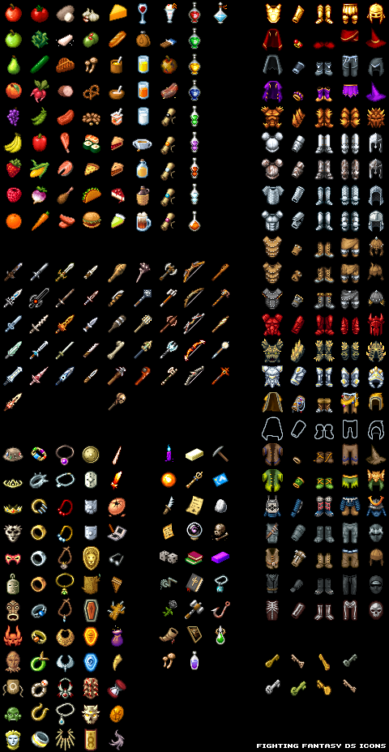

## ローグライクゲームを作ってみるその8 アイテム

### 過去記事一覧

* [その1 タイトル画面](https://qiita.com/pizyumi/items/3526fddd4f18a462e1ae)
* [その2 ダンジョン・プレイヤーの生成と描画](https://qiita.com/pizyumi/items/2562a159f497a608615b)
* [その3 プレイヤーの移動](https://qiita.com/pizyumi/items/07447c9a1a52b0d9a228)
* [その4 ダンジョンのランダム生成]()
* [その5 ダンジョンのサイズ]()

現在のコードについては前回の記事の最後の項を参照してください。

### アイテム

今回はアイテムを追加します。

アイテムは基本的にはダンジョンに落ちているものを拾うという形で入手することにします。

そうすると、アイテムに関する処理としては下のようなものが必要になってきます。

* アイテムのダンジョン内での生成
* ダンジョン内のアイテムの描画
* プレイヤーがアイテムを拾う処理
* プレイヤーが持っているアイテムの表示
* アイテムの使用

上から順番に実装していきます。

### アイテムの生成

まずダンジョンのフロア内にアイテムを配置しないとですね。

まずアイテムの定義を行いましょう。

今回ゲームに追加するアイテムは「リンゴ」と「回復薬」の2種類とします。

「リンゴ」は満腹度が回復するアイテムで、「回復薬」はHPが回復するアイテムです。

全てのアイテムは重さを持ちます。プレイヤーがアイテムを幾らでも持てるのは反則的なので、プレイヤーが持てるアイテムの量には重量制限を掛けます。そのために全てのアイテムには重さを定義しなければなりません。

```js
var I_APPLE_NAME = 'リンゴ';
var I_HEALTH_POTION_NAME = '回復薬';
```

```js
var I_APPLE = 0;
var I_HEALTH_POTION = 1;

var I_INFO = [];
I_INFO[I_APPLE] = {
	dname: I_APPLE_NAME,
	weight: 0.1
};
I_INFO[I_HEALTH_POTION] = {
	dname: I_HEALTH_POTION_NAME,
	weight: 0.1
};
```

また、アイテムはカテゴリを持つものとします。

とりあえず食べ物カテゴリとポーションカテゴリを定義します。

```js
var I_CAT_FOOD = 0;
var I_CAT_POTION = 1;
```

アイテムが定義できたところで、フロア生成の際にアイテムを配置する処理を追加しましょう。

`create_field`関数を下のように変更します。

フロアのそれぞれの部屋にアイテムが0～1個ランダムに配置されるようにします。

アイテムはマスに配置されるので、アイテムを表すオブジェクトはマスを表すオブジェクトの`items`プロパティに配列として格納することにします。

下のプログラムでは`Random`クラスの`select`メソッドを使用していますが、このメソッドはまだ実装していません（後で実装します）。

`select`メソッドはある値をどれくらいの確率で生成するかという設定を`Map`クラスのインスタンスとして受け取り、その設定に従ってランダムに値を返すというメソッドです。

`Map`クラスのインスタンスに追加したそれぞれの要素のキーが返される値の候補となり、値が値が返される割合となります。

たとえば、下のプログラムでは`Map`クラスのインスタンスを生成し、`ctable`変数に格納し、そのインスタンスにキーが`I_CAT_FOOD`で値が`20`の要素とキーが`I_CAT_POTION`で値が`80`の要素を追加しています。

このインスタンスを`select`メソッドの引数として渡せば、20対80の割合で`I_CAT_FOOD`と`I_CAT_POTION`がランダムに返ってくるということになります。

`I_CAT_FOOD`が返ってきた場合にはアイテムとして食べ物カテゴリーのものを生成するものとします。現状食べ物カテゴリーのアイテムは「リンゴ」しかありませんので、「リンゴ」を生成することになります。

`I_CAT_POTION`が返ってきた場合にはアイテムとしてポーションカテゴリーのものを生成するものとします。現状ポーションカテゴリーのアイテムは「回復薬」しかありませんので、「回復薬」を生成することになります。

ただし、回復薬にはレベルを付加するものとします。分かりやすく言えば、レベルというのは回復薬の強さです。回復薬を使用した場合、レベル×10ポイントのHPが回復することにします。

フロアに配置される回復薬の最高レベルはフロアの階数によって決まるものとします。ただし、20%の確率でレベルが高めのものが配置され、5%の確率でレベルがもう少し高いものが配置されることにします。

```js
function create_field (depth, upstairs, base_seed) {
（省略）
	var npcs = [];
	for (var i = 0; i < ers.length; i++) {
（省略）
		var num_item = Math.floor(random.fraction() + 0.5);
		for (var j = 0; j < num_item; j++) {
			var x = random.num(ers[i].x2 - ers[i].x1) + ers[i].x1;
			var y = random.num(ers[i].y2 - ers[i].y1) + ers[i].y1;
			if (!blocks[x][y].items) {
				blocks[x][y].items = [];
			}

			var ctable = new Map();
			ctable.set(I_CAT_FOOD, 20);
			ctable.set(I_CAT_POTION, 80);
			var cat = random.select(ctable);
			if (cat === I_CAT_FOOD) {
				var type = I_APPLE;
				var e = I_INFO[type];
				blocks[x][y].items.push({
					dname: e.dname,
					type: type,
					cat: cat,
					weight: e.weight
				});
			}
			else if (cat === I_CAT_POTION) {
				var type = I_HEALTH_POTION;
				var e = I_INFO[type];
				var baselevel = Math.ceil(depth / 4);
				var ltable = new Map();
				ltable.set(random.num(baselevel) + 1, 75);
				ltable.set(baselevel + 1, 20);
				ltable.set(baselevel + 2, 5);
				var level = random.select(ltable);
				blocks[x][y].items.push({
					dname: e.dname + level * 10,
					type: type,
					cat: cat,
					level: level,
					weight: e.weight
				});
			}
		}
	}
（省略）
}
```

上で使用した`Random`クラスの`select`メソッドを実装します。

割合を考慮して値をランダムに返します。

```js
	select (table) {
		var sum = 0;
		for (var i of table.entries()) {
			sum += i[1];
		}
		var num = this.num(sum);
		var sum2 = 0;
		for (var i of table.entries()) {
			sum2 += i[1];
			if (num < sum2) {
				return i[0];
			}
		}
	}
```

一応テストコードも書きました。

```js
function test_random_class_select () {
	var table = new Map();
	table.set('a', 5);
	table.set('b', 15);
	table.set('c', 20);
	table.set('d', 10);
	table.set('e', 30);
	table.set('f', 20);

	var a = ['e', 'b', 'e', 'e', 'e', 'f', 'd', 'e',
	  'f', 'c', 'd', 'f', 'e', 'c', 'e', 'c',
		'f', 'd', 'b', 'f', 'e', 'f', 'b', 'f',
		'f', 'f', 'a', 'd', 'e', 'e', 'b', 'c'];
	var r = new Random('yurina');
	for (var i = 0; i < a.length; i++) {
		if (r.select(table) !== a[i]) {
			throw new Error('test_random_class_select');
		}
	}
}
```

### アイテムの描画

フロアに配置したアイテムをゲーム画面に描画します。

アイテムの描画にはネットで適当に拾ってきたゲーム素材を使用することにします（どこで拾ったか忘れました・・・）。

下のようなゲーム素材を使用します。この中に含まれている階段の画像を利用します。



この画像のファイル名は`fighting_fantasy_icons.png`とします。

まず、画像の読み込みを行います。

```js
var img2 = new Image();
img2.src = 'fighting_fantasy_icons.png';
```

そして、`draw`関数のマスを描画する処理を下のように変更します。

マスにアイテムが配置されている場合にはアイテムの画像を描画します。

```js
	for (var i = 0; i < SX; i++) {
		for (var j = 0; j < SY; j++) {
			var block = fields[player.depth].blocks[ox + i][oy + j];
			if (block.base === B_FLOOR) {
（省略）
			}
			else if (block.base === B_WALL) {
（省略）
			}
			else if (block.base === B_DOWNSTAIR) {
				con.drawImage(img, 4 * 32, 5 * 32, 32, 32, i * PX, j * PY, PX, PY);
			}

			if (block.items) {
				for (var k = 0; k < block.items.length; k++) {
					if (block.items[k].type === I_APPLE) {
						con.drawImage(img2, 0 * 32, 0 * 32, 32, 32, i * PX, j * PY, PX, PY);
					}
					else if (block.items[k].cat === I_CAT_POTION) {
						con.drawImage(img2, 7 * 32, 4 * 32, 32, 32, i * PX, j * PY, PX, PY);
					}
				}
			}
		}
	}
```

### アイテムの取得

アイテムが配置でき、描画もできたので、アイテムを拾うための処理を実装しましょう。

アイテムはプレイヤーをアイテムが置かれているマスの上に移動し、スペースキーを押すことで拾えることにします。

持てるアイテムには重量制限が設けられますので、プレイヤーが持っているアイテムの総重量を管理するためのプロパティを`Player`クラスに追加しなければなりません。また、プレイヤーが持っているアイテムを表すオブジェクトを格納するプロパティも追加しなければなりません。

`Player`クラスを下のように変更します。

下のようなプロパティを追加します。

* `weightbase`・・・ベースの重量制限です。とりあえず`10.0`としておきます。
* `weightext`・・・付加的な重量制限です。
* `weight`・・・持っているアイテムの総重量を表します。
* `weightfull`・・・重量の上限です。
* `items`・・・持っているアイテムを表すオブジェクトを格納する配列です。

```js
class Player {
	constructor () {
（省略）
		this.level = 1;
		this.hpbase = 16;
		this.hpext = 0;
		this.energybase = 100;
		this.energyext = 0;
		this.weightbase = 10.0;
		this.weightext = 0.0;
		this.atkbase = 4;
		this.atkext = 0;
		this.defbase = 4;
		this.defext = 0;
		this.expfull = 4;

		this.hp = this.hpfull;
		this.hp_fraction = 0;
		this.energy = this.energyfull;
		this.energy_turn = 0;
		this.weight = 0.0;
		this.exp = 0;

		this.items = [];
	}
（省略）
	get weightfull () {
		return this.weightbase + this.weightext;
	}
（省略）
}
```

プレイヤーのステータス描画処理で持っているアイテムの総重量と重量制限を描画するようにします。

ゲーム画面に描画するテキストを保持する変数を追加します。

```js
var TEXT_WEIGHT = 'アイテム重量';
```

`draw`関数のステータス描画処理を下のように変更します。

```js
	con.save();
	con.textBaseline = 'top';
	con.textAlign = 'left';
	con.font = '24px consolas';
	con.fillStyle = 'white';
	con.translate(SX * PX, 0);
	con.fillText(player.depth + TEXT_DEPTH, 8, (24 + 6) * 0 + 8);
	con.fillText(TEXT_LEVEL + '：' + player.level, 8, (24 + 6) * 1 + 8);
	con.fillText(TEXT_HP + '：' + player.hp + '/' + player.hpfull, 8, (24 + 6) * 2 + 8);
	con.fillText(TEXT_ENERGY + '：' + player.energy + '/' + player.energyfull, 8, (24 + 6) * 3 + 8);
	con.fillText(TEXT_WEIGHT + '：' + (Math.round(player.weight * 10) / 10) + '/' + player.weightfull, 8, (24 + 6) * 4 + 8);
	con.fillText(TEXT_ATK + '：' + player.atk, 8, (24 + 6) * 5 + 8);
	con.fillText(TEXT_DEF + '：' + player.def, 8, (24 + 6) * 6 + 8);
	con.fillText(TEXT_EXP + '：' + player.exp + '/' + player.expfull, 8, (24 + 6) * 7 + 8);
	con.restore();
```

必要なメッセージテキストを追加します。

```js
var MSG_PICKUP = ({name}) => `${name}を拾いました。`;
var MSG_CANT_PICKUP = ({name}) => `${name}を拾おうとしましたが、持ちきれませんでした。`;
```

2つ目の`keydown`イベントハンドラを下のように変更します。

スペースキーが押された場合、プレイヤーがいるマスにアイテムが落ちている場合にはそのアイテムを拾います。

ただし、重量制限を超えてしまう場合には拾うことができません。

```js
	c.on('keydown', function (e) {
（省略）
		if (e.keyCode >= 37 && e.keyCode <= 40) {
（省略）
		}
		else if (e.keyCode === 32) {
			var block = fields[player.depth].blocks[player.x][player.y];
			if (block.items && block.items.length > 0) {
				var item = block.items[0];
				if (player.weight + item.weight <= player.weightfull) {
					block.items.shift();
					player.items.push(item);
					player.weight += item.weight;
					add_message({
						text: MSG_PICKUP({name: item.dname}),
						type: 'normal'
					});
				}
				else {
					add_message({
						text: MSG_CANT_PICKUP({name: item.dname}),
						type: 'important'
					});
				}
			}
			else if (block.base === B_DOWNSTAIR) {
（主略）
			}
			else {
				return;
			}
		}
		else {
			return;
		}

		execute_turn();

		draw(con, env);
	});
```

### プレイヤーの所持アイテムの描画

プレイヤーがアイテムを持つことができるようになったら、次はプレイヤーが持っているアイテムをゲーム画面に表示しましょう。

プレーヤーが持っているアイテムはゲーム画面のステータス表示部分とメッセージ表示部分の間に表示することにします。

しかし、アイテムを沢山持つと持っているアイテムの表示がこの部分に収まりきらないかもしれません。

収まりきらない場合には一度に一部のアイテムしか表示できません。

収まりきらない場合にどのアイテムから表示を行うかを制御するために`invoffset`変数を追加します。

ゲーム画面のアイテム表示部分には`invoffset`変数の値のインデックスのアイテムから最大10個のみを表示することにします。

```js
var invoffset = 0;
```

`init`関数に`invoffset`変数を初期化するコードを追加します。

```js
function init () {
	invoffset = 0;
	gameover = false;
（省略）
}
```

`draw`関数に下のようなコードを追加します。

```js
	con.save();
	con.textBaseline = 'middle';
	con.textAlign = 'left';
	con.font = '24px consolas';
	con.fillStyle = 'white';
	con.translate(SX * PX, 284);
	for (var i = invoffset; i < invoffset + 10 && i < player.items.length; i++) {
		var item = player.items[i];
		if (item.type === I_APPLE) {
			con.drawImage(img2, 0 * 32, 0 * 32, 32, 32, 8 + 12, (24 + 6) * (i - invoffset) - (32 / 2) - 2, 32, 32);
		}
		else if (item.cat === I_CAT_POTION) {
			con.drawImage(img2, 7 * 32, 4 * 32, 32, 32, 8 + 12, (24 + 6) * (i - invoffset) - (32 / 2) - 2, 32, 32);
		}
		con.fillText(item.dname, 8 + 12 + 32 + 4, (24 + 6) * (i - invoffset));
	}
	con.restore();
```

### アイテムの使用

最後にアイテムを使用できるようにします。

アイテムの使用はアイテムに対して何らかのコマンドを実行することによって行われます。

しかし、あらゆるアイテムに対してあらゆるコマンドが実行できる訳ではありません。実行できるコマンドはアイテムやアイテムのカテゴリーによって決まります。

「リンゴ」の場合、実行可能なコマンドは「食べる」や「置く」などです。

「リンゴ」を食べると、プレイヤーの満腹度が回復します。また、「リンゴ」はプレイヤーがいるマスに置くこともできます。

「回復薬」の場合、実行可能なコマンドは「飲む」や「置く」などです。

「回復薬」を飲むと、プレイヤーのHPが回復します。また、「回復薬」はプレイヤーがいるマスに置くこともできます。

基本的にアイテムはカテゴリーによって実行可能なコマンドの種類が決まるため、とりあえずアイテムのカテゴリーごとに実行可能なコマンドを定義することにします。

ただ、その前に「食べる」や「置く」などのコマンドの処理をそれぞれ関数として用意しておきましょう。

まずメッセージテキストを定義します。

```js
var MSG_PUT = ({name}) => `${name}を置きました。`;
var MSG_EAT_FOOD = ({name, diff}) => `${name}を食べました。満腹度が${diff}回復しました。`;
var MSG_QUAFF_HPOTION = ({name, diff}) => `${name}を飲みました。HPが${diff}回復しました。`;
```

アイテムに対してコマンドを実行するには対象のアイテムが決まっていなければなりませんので、対象のアイテムを表す変数として`invindex`変数を追加します。

```js
var invindex = 0;
```

`invindex`変数は`init`関数で初期化します。

```js
function init () {
	invindex = 0;
	invoffset = 0;
	gameover = false;
（省略）
}
```

1つ目は「置く」コマンドです。

対象のアイテムをプレイヤーの所持アイテムの中からプレイヤーがいるマスに移動するだけです。

```js
function put () {
	var item = player.items[invindex];
	player.items.splice(invindex, 1);
	player.weight -= item.weight;
	var block = fields[player.depth].blocks[player.x][player.y];
	if (!block.items) {
		block.items = [];
	}
	block.items.push(item);
	add_message({
		text: MSG_PUT({name: item.dname}),
		type: 'normal'
	});
}
```

2つ目は「食べる」コマンドです。

対象アイテムはプレイヤーの所持アイテムの中から削除され、アイテムが「リンゴ」である場合にはプレイヤーの満腹度が最大で50ポイント回復します。

```js
function eat () {
	var item = player.items[invindex];
	player.items.splice(invindex, 1);
	player.weight -= item.weight;
	if (item.type === I_APPLE) {
		var old = player.energy;
		player.energy += 50;
		if (player.energy >= player.energyfull) {
			player.energy = player.energyfull;
			player.energy_turn = 0;
		}
		add_message({
			text: MSG_EAT_FOOD({name: item.dname, diff: player.energy - old}),
			type: 'normal'
		});
	}
}
```

3つ目は「飲む」コマンドです。

対象アイテムはプレイヤーの所持アイテムの中から削除され、アイテムが「回復薬」である場合にはプレイヤーのHPが最大で回復薬のレベル×10ポイント回復します。

```js
function quaff () {
	var item = player.items[invindex];
	player.items.splice(invindex, 1);
	player.weight -= item.weight;
	if (item.type === I_HEALTH_POTION) {
		var old = player.hp;
		player.hp += item.level * 10;
		if (player.hp >= player.hpfull) {
			player.hp = player.hpfull;
			player.hp_fraction = 0;
		}
		add_message({
			text: MSG_QUAFF_HPOTION({name: item.dname, diff: player.hp - old}),
			type: 'normal'
		});
	}
}
```

コマンドの処理が実装できたら、次はアイテムのカテゴリーに関する情報を定義します。

`actions`プロパティでそのカテゴリーに属するアイテムに対して実行可能なコマンドを配列として定義します。

それぞれのコマンドはオブジェクトとして表し、`dname`プロパティでコマンドの名称を定義し、`exec`プロパティでコマンドの動作を定義します。

```js
var ACTION_EAT = '食べる';
var ACTION_QUAFF = '飲む';
var ACTION_PUT = '置く';
```

```js
var I_CAT_INFO = [];
I_CAT_INFO[I_CAT_FOOD] = {
	actions: [
		{ dname: ACTION_EAT, exec: () => eat() },
		{ dname: ACTION_PUT, exec: () => put() }
	]
};
I_CAT_INFO[I_CAT_POTION] = {
	actions: [
		{ dname: ACTION_QUAFF, exec: () => quaff() },
		{ dname: ACTION_PUT, exec: () => put() }
	]
};
```

次にアイテムを使用する操作を実装しましょう。

`x`キーを押すとアイテムを選択できる状態になり、上矢印キーや下矢印キーで使用するアイテムを選択し、`z`キーで使用するアイテムを決定することにしましょう。

まず、`x`キーを押した時の処理を実装します。

メッセージテキストを定義します。

```js
var MSG_EMPTY_INV = '何も持っていません。';
```

アイテムを選択できる状態になっているかを保持するためのフラグとなる`invf`変数を追加します。

```js
var invf = false;
```

`invf`変数は`init`関数で初期化します。

```js
function init () {
	invf = false;
	invindex = 0;
	invoffset = 0;
	gameover = false;
（省略）
}
```

2つ目の`keydown`イベントハンドラを下のように変更します。

プレイヤーがアイテムを1つも持っていない場合にはメッセージを表示し、持っている場合には`invf`変数の値を`true`にします。

また、選択中のアイテムのインデックスは`invindex`変数によって保持されます。

```js
	c.on('keydown', function (e) {
（省略）
		if (e.keyCode >= 37 && e.keyCode <= 40) {
（省略）
		}
		else if (e.keyCode === 32) {
（省略）
		}
		else if (e.keyCode === 88) {
			if (player.items.length === 0) {
				add_message({
					text: MSG_EMPTY_INV,
					type: 'normal'
				});
			}
			else {
				invf = !invf;
				if (invindex < 0) {
					invindex = 0;
				}
				else if (invindex >= player.items.length) {
					invindex = player.items.length - 1;
				}
			}

			draw(con, env);

			return;
		}
		else {
			return;
		}

		execute_turn();

		draw(con, env);
	});
```

`invf`変数の値を`true`である場合には使用するアイテムが選択できなければなりません。

選択中のアイテムを示すためにゲーム画面のアイテム欄では選択中のアイテムの横に`>`を描画することにします。

`draw`関数のアイテム欄描画処理を下のように変更します。

```js
	con.save();
	con.textBaseline = 'middle';
	con.textAlign = 'left';
	con.font = '24px consolas';
	con.fillStyle = 'white';
	con.translate(SX * PX, 284);
	for (var i = invoffset; i < invoffset + 10 && i < player.items.length; i++) {
		var item = player.items[i];
		if (item.type === I_APPLE) {
			con.drawImage(img2, 0 * 32, 0 * 32, 32, 32, 8 + 12, (24 + 6) * (i - invoffset) - (32 / 2) - 2, 32, 32);
		}
		else if (item.cat === I_CAT_POTION) {
			con.drawImage(img2, 7 * 32, 4 * 32, 32, 32, 8 + 12, (24 + 6) * (i - invoffset) - (32 / 2) - 2, 32, 32);
		}
		con.fillText(item.dname, 8 + 12 + 32 + 4, (24 + 6) * (i - invoffset));
		if (invf && i === invindex) {
			con.fillText('>', 8, (24 + 6) * (i - invoffset));
		}
	}
	con.restore();
```

次に、上矢印キーや下矢印キーで選択中のアイテムを変更できるようにします。

また、`z`キーでアイテムの選択を決定することができるようにします。

また、`x`キーでアイテムの選択をキャンセルできるようにします。

使用するアイテムが決まった場合にはアイテムごとに決まっている使用可能なコマンドの内どのコマンドを実行するのかを選択しなければなりません。

そこで、コマンドを選択できる状態になっているかを保持するためのフラグとなる`invactf`変数と選択しているコマンドのインデックスを保持する`invactindex`変数を追加します。

```js
var invactf = false;
var invactindex = 0;
```

`invactf`変数と`invactindex`変数は`init`関数で初期化します。

```js
function init () {
	invf = false;
	invindex = 0;
	invoffset = 0;
	invactf = false;
	invactindex = 0;
	gameover = false;
（省略）
}
```

2つ目の`keydown`イベントハンドラを下のように変更します。

`invf`変数の値が`true`である場合に上矢印キーや下矢印キーや`z`キーや`x`キーが押された時の処理を追加します。

```js
	c.on('keydown', function (e) {
（省略）
		if (e.keyCode === 16) {
（省略）
		}

		if (invf) {
			if (e.keyCode === 38) {
				invindex--;
				if (invindex < 0) {
					invindex = player.items.length - 1;
					if (invoffset + 10 <= invindex) {
						invoffset = invindex - 10 + 1;
					}
				}
				else {
					if (invoffset > invindex) {
						invoffset = invindex;
					}
				}
			}
			else if (e.keyCode === 40) {
				invindex++;
				if (invindex >= player.items.length) {
					invindex = 0;
					if (invoffset > invindex) {
						invoffset = invindex;
					}
				}
				else {
					if (invoffset + 10 <= invindex) {
						invoffset = invindex - 10 + 1;
					}
				}
			}
			else if (e.keyCode === 88) {
				invf = !invf;
			}
			else if (e.keyCode === 90) {
				invactf = !invactf;
				invactindex = 0;
			}

			draw(con, env);

			return;
		}
（省略）
	});
```

`invactf`変数の値が`true`である場合にはゲーム画面のアイテム欄にアイテム一覧の代わりに選択したアイテムのコマンド一覧を表示することにします。

`draw`関数のアイテム欄描画処理を下のように変更します。

```js
	con.save();
	con.textBaseline = 'middle';
	con.textAlign = 'left';
	con.font = '24px consolas';
	con.fillStyle = 'white';
	con.translate(SX * PX, 284);
	if (!invactf) {
		for (var i = invoffset; i < invoffset + 10 && i < player.items.length; i++) {
			var item = player.items[i];
			if (item.type === I_APPLE) {
				con.drawImage(img2, 0 * 32, 0 * 32, 32, 32, 8 + 12, (24 + 6) * (i - invoffset) - (32 / 2) - 2, 32, 32);
			}
			else if (item.cat === I_CAT_POTION) {
				con.drawImage(img2, 7 * 32, 4 * 32, 32, 32, 8 + 12, (24 + 6) * (i - invoffset) - (32 / 2) - 2, 32, 32);
			}
			con.fillText(item.dname, 8 + 12 + 32 + 4, (24 + 6) * (i - invoffset));
			if (invf && i === invindex) {
				con.fillText('>', 8, (24 + 6) * (i - invoffset));
			}
		}
	}
	else {
		var cinfo = I_CAT_INFO[player.items[invindex].cat];
		for (var i = 0; i < cinfo.actions.length; i++) {
			con.fillText(cinfo.actions[i].dname, 8 + 12, (24 + 6) * (i - invoffset));
			if (i === invactindex) {
				con.fillText('>', 8, (24 + 6) * (i - invoffset));
			}
		}
	}
	con.restore();
```

最後にコマンド選択の操作を実装します。

2つ目の`keydown`イベントハンドラを下のように変更します。

`invactf`変数の値が`true`の状態で上矢印キーや下矢印キーや`x`キーや`z`キーが押された場合の処理を追加します。

`invactf`変数の値が`true`の状態で`z`キーが押された場合には選択されているコマンドを実行します。

アイテムに対するコマンドの実行は1ターンを消費するので、最後に`execute_turn`関数を呼び出さなければなりません。

```js
	c.on('keydown', function (e) {
（省略）
		if (e.keyCode === 16) {
（省略）
		}

		if (invf) {
			if (invactf) {
				var actions = I_CAT_INFO[player.items[invindex].cat].actions;
				if (e.keyCode === 38) {
					invactindex--;
					if (invactindex < 0) {
						invactindex = actions.length - 1;
					}
				}
				else if (e.keyCode === 40) {
					invactindex++;
					if (invactindex >= actions.length) {
						invactindex = 0;
					}
				}
				else if (e.keyCode === 88) {
					invactf = !invactf;
				}
				else if (e.keyCode === 90) {
					actions[invactindex].exec();

					invactf = !invactf;
					invf = !invf;

					execute_turn();
				}
			}
			else {
				if (e.keyCode === 38) {
					invindex--;
					if (invindex < 0) {
						invindex = player.items.length - 1;
						if (invoffset + 10 <= invindex) {
							invoffset = invindex - 10 + 1;
						}
					}
					else {
						if (invoffset > invindex) {
							invoffset = invindex;
						}
					}
				}
				else if (e.keyCode === 40) {
					invindex++;
					if (invindex >= player.items.length) {
						invindex = 0;
						if (invoffset > invindex) {
							invoffset = invindex;
						}
					}
					else {
						if (invoffset + 10 <= invindex) {
							invoffset = invindex - 10 + 1;
						}
					}
				}
				else if (e.keyCode === 88) {
					invf = !invf;
				}
				else if (e.keyCode === 90) {
					invactf = !invactf;
					invactindex = 0;
				}
			}

			draw(con, env);

			return;
		}
（省略）
	});
```

これでアイテムを使用することができるようになりました。


### 今回はここまで

今回はここまでです。

`game.js`は下のようになりました。

```js
```

次回はマップの描画について考えたいと思います。
